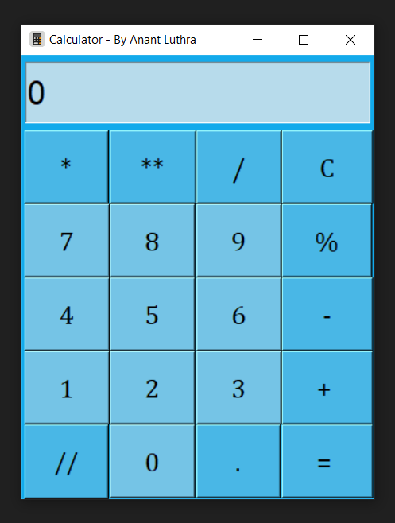
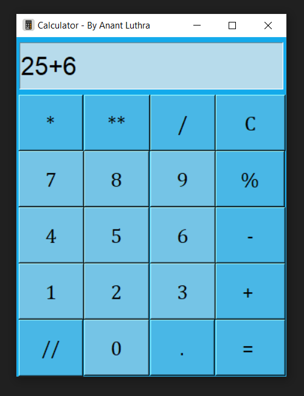

# Calculator GUI

This is a simple calculator GUI made using Python and Tkinter.

## Some Features

- You can use it by clicking on buttons also by using keyboard.
- Pressing "C" or "c" on keyboard will clear the screen.
- Pressing "Enter" on keyboard will give you the result.
- Pressing "Backspace" on keyboard will delete the last character.

## Some Screenshots

---

